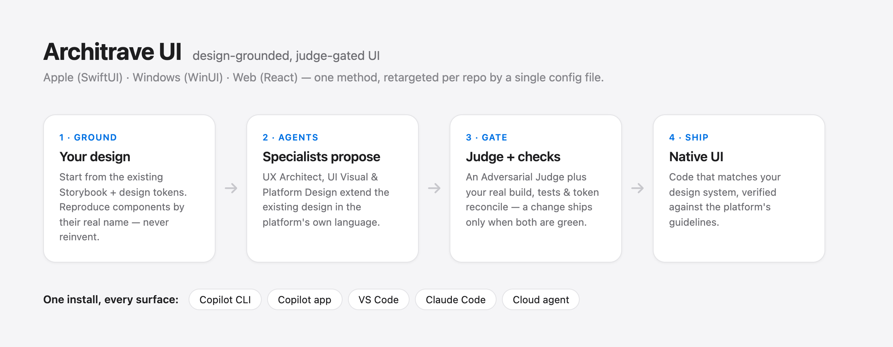
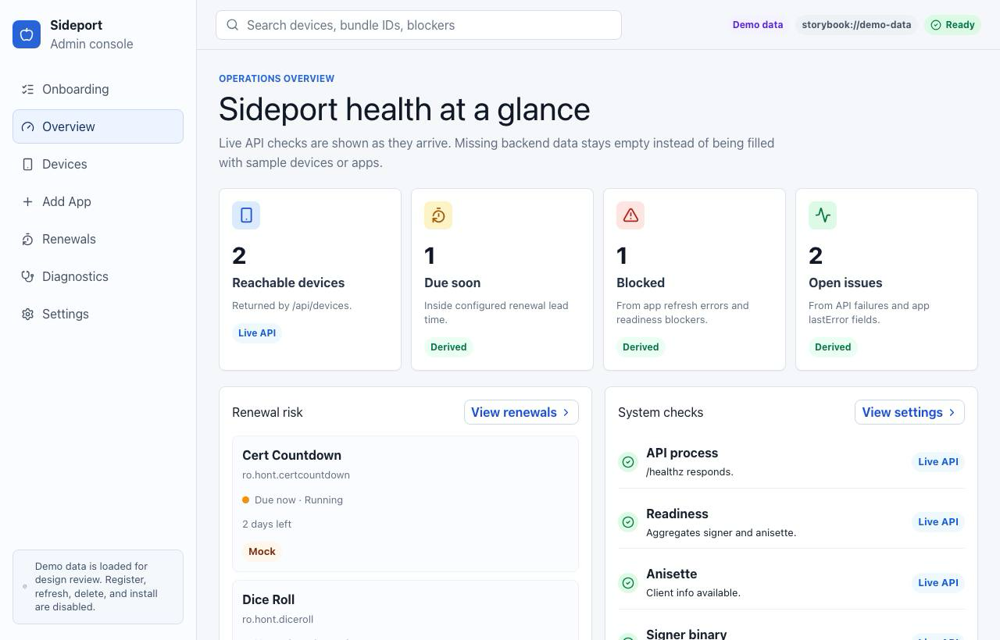
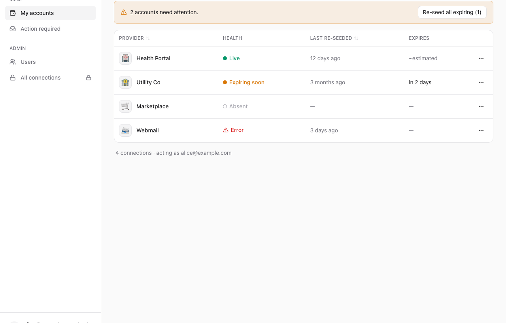
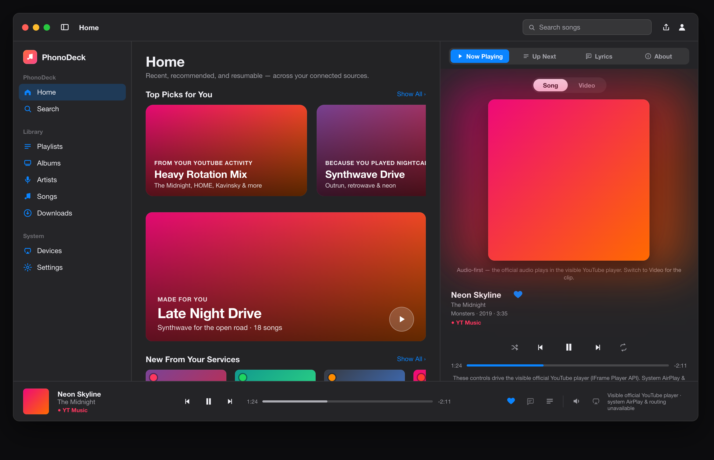
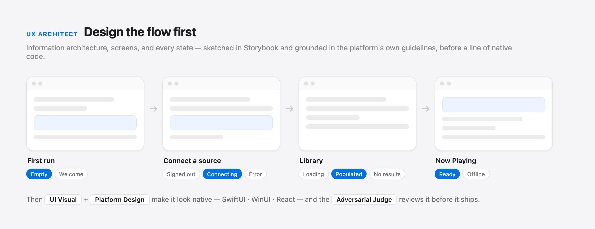
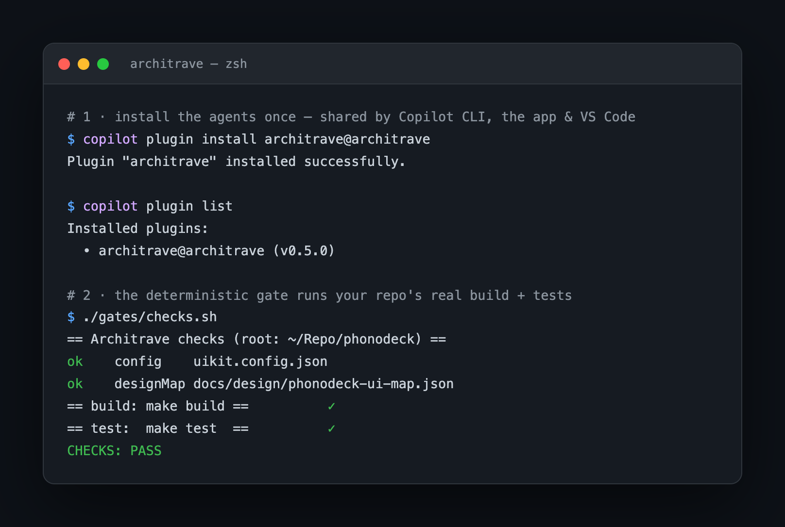

# Architrave

**An AI agent that runs a full-stack specialist crew inside GitHub Copilot or Claude Code.**

Architrave helps you build a full-stack application, or any slice of one, without turning your codebase into an agent experiment. You ask for the feature; Architrave reads the repo, grounds in its Storybook/design map and backend architecture docs, runs the right specialist agents, and ships only the smallest proven change.

It has Apple and Microsoft design language built in, plus web/WCAG guidance, Storybook-first UI, contract-first backend work, plan-only infrastructure, YAGNI, Tournament of Options, durable learning artifacts, and an Adversarial Judge. The point is simple: build the useful thing, in the repo's own patterns, with evidence.



## Built With Architrave

<table>
        <tr>
                <th width="33%">PhonoDeck</th>
                <th width="33%">Sideport</th>
                <th width="33%">Tessera</th>
        </tr>
        <tr>
                <td></td>
                <td></td>
                <td></td>
        </tr>
        <tr>
                <td>Native macOS music app. Storybook design source, SwiftUI implementation.</td>
                <td>Web admin console. React UI, .NET backend, Kubernetes runtime.</td>
                <td>Homelab access console. React UI, .NET backend, connection health workflows.</td>
        </tr>
</table>

## The Crew

**Architrave** is the front door. It stays in control of the plan, routes focused work to specialists, and refuses to call the job done until real checks pass.

| Agent | Invoke | What it owns |
|---|---|---|
| **Architrave** | directly | Leads the whole run: intake, tournament, YAGNI ladder, Storybook/contract sign-off, implementation, gates, and final summary. |
| **Product Research** | under the hood | Finds shipped product/workflow patterns, competitor references, and domain-specific traps before planning. |
| **Operations UX** | under the hood | Turns admin/operations research into setup, offboarding, inventory, catalog/upload, RBAC, health, diagnostics, queue/job, and audit patterns with contract requirements. |
| **UX Architect** | directly | Information architecture, navigation, flows, interaction model, keyboard/input behavior, and empty/loading/error states. |
| **UI Visual** | directly | Visual hierarchy, layout, tokens, typography, color/materials, iconography, and polish. |
| **Platform Design** | under the hood | Native platform correctness: Apple HIG, Microsoft Fluent, or web/WCAG, depending on `architrave.config.json`. |
| **Service Architect** | under the hood | Backend boundaries, API/data contracts, ADR fit, auth surfaces, and source-of-truth architecture decisions. |
| **Backend Planner** | under the hood | Turns the backend contract into ordered slices, migration/rollback notes, risk, and human sign-off checklist. |
| **Backend Implementer** | under the hood | Implements approved backend/service slices and tests against the contract. |
| **Infra Engineer** | under the hood | Proposes IaC diffs and plan/policy output only. It never applies. |
| **Runtime Observer** | under the hood | Reads deployment/runtime truth such as Kubernetes health, logs, ingress, Flux, and version drift. Read-only by default. |
| **Adversarial Judge** | under the hood | Grades proposals and implementations against the rubric: PASS / REVISE / FAIL. |

## Install

Install the plugin once in your agent client:

With **GitHub Copilot** (CLI, desktop app, or VS Code):

```bash
copilot plugin marketplace add dragoshont/architrave
copilot plugin install architrave@architrave
```

Or with **Claude Code**:

```bash
claude plugin marketplace add dragoshont/architrave
claude plugin install architrave@architrave
```

Then **adopt/ground each repository** so local agents, cloud agents, and deterministic gates all see the same source of truth. This is a per-repo step: run the shell script on macOS/Linux, or the PowerShell script on Windows:

```bash
/path/to/architrave/tools/install.sh .                          # macOS / Linux
pwsh -NoProfile -File /path/to/architrave/tools/install.ps1 .    # Windows
```

Edit `architrave.config.json` to point at the repo's Storybook/design source, build/test commands, optional backend, optional IaC, optional runtime observation, and optional learning paths. Then ask the **Architrave** agent to build a feature.

**Updating.** Releases bump the plugin version, so a plain update pulls them:

```bash
copilot plugin update architrave
claude plugin marketplace update architrave
claude plugin update architrave@architrave
```

After updating the plugin, users **must also refresh each adopted repo's copied kit assets**. A plugin update refreshes the locally installed agent package only; it does not change the copied `gates/`, `harness/`, `knowledge/`, or `AGENTS.md` stanza inside existing repos. Run the matching repo script in every adopted repo. This leaves `architrave.config.json` and copied `.github/agents` untouched by default:

```bash
/path/to/architrave/tools/update.sh .
pwsh -NoProfile -File /path/to/architrave/tools/update.ps1 .
```

When the Architrave crew itself changes and you want to refresh the copied repo agents too, opt in explicitly after archiving any bespoke repo agents:

```bash
/path/to/architrave/tools/update.sh --agents .
pwsh -NoProfile -File /path/to/architrave/tools/update.ps1 . -Agents
```

## How It Works

Open your assistant, pick the **Architrave** agent, and describe the change in plain language:

> Add an empty state to the library list — an icon, a short message, and a primary action.

Architrave starts with visible intake: understanding, acceptance criteria, grounding sources, assumptions, and blocking questions. Then it runs a **Tournament of Options** plus the **YAGNI ladder**: skip/delete, reuse existing repo source of truth, platform/native feature, standard library, installed dependency, tiny local implementation, and only then new abstraction/dependency/config when the current task proves it. The recommended plan must explain why it beats the alternatives before implementation starts.

For UI, Architrave starts in **Storybook** or the configured design source, not in random app code. For backend/full-stack, it starts with the **contract** so UI and backend do not drift. For infrastructure, it stops at **plan/policy output** and leaves apply to a human. For non-trivial work, it writes run artifacts under `.architrave/runs/` so future agents can resume from evidence instead of chat memory.

**Full-stack is built in.** Set a `backend` and/or `iac` block in `architrave.config.json` and the same conductor extends past UI. Repos without a service, infra, or runtime lane simply omit those blocks.

**Learning is explicit.** Set the optional `learning` block and Architrave keeps per-run evidence, a concise repo profile, and candidate repeated lessons. Lessons only become standing repo guidance after validation and review.

**YAGNI is enforced.** Architrave uses a minimum-sufficient-change ladder grounded in `knowledge/yagni.md`. It blocks speculative abstractions, unused config, new dependencies, and wrapper layers until the task proves they are needed. It still keeps the practices that make YAGNI safe: refactoring, contracts, tests, validation, security, accessibility, and design-token reconciliation.

**Operations UX is source-backed.** When a feature is an admin console, device/fleet workflow, app catalog/upload, setup/offboarding flow, user/RBAC surface, diagnostic page, queue, scheduled job, or long-running action, Architrave loads `knowledge/operations-ux.md` and routes to **Operations UX**. The rule is simple: no status without source/timestamp/scope, no mutation without preflight and durable job state, no destructive flow without impact/recovery/audit, and no generic dashboard where the product needs object lists, queues, issues, or evidence.

## Benchmarks

Architrave now ships a benchmark harness because agent quality has to be measured against real work, not vibes. The suite in `benchmarks/` runs frozen tasks against real local repos in detached worktrees, compares agent arms such as `copilot-baseline` and `copilot-architrave`, and records JSONL rows with validation results, diff size, output tokens, wall time, artifacts, and optional Copilot LLM-judge scores.

The first smoke benchmark is intentionally small: a PhonoDeck learning-loop task that asks the agent to capture a real build/relaunch gotcha as durable repo knowledge without touching product code. It proves the harness path end to end.

| Run | Arm | Result | Gates | Judge | Output tokens | Wall time | Diff |
|---|---|---:|---|---|---:|---:|---:|
| `pilot-architrave-learning-20260622T073711Z` | `copilot-architrave` | **PASS** | `checks.sh --quick` + `validate-run.sh` PASS | PASS, 5/5 across correctness / clarity / YAGNI / process / repo fit | 3,893 | 393.9s | +117 LOC / 10 artifact files |

Read that honestly: it is a verified smoke, not a leaderboard. A generic baseline run on the same learning scenario timed out before producing the required run artifacts, which is useful failure data, but we are not publishing a broad win claim until the full curated suite runs with repeats and human review. The important part is the shape of the evidence: every claim is tied to a scenario, a pinned commit, a worktree, deterministic gates, a patch, and an optional judge row.

Reproduce the harness checks:

```bash
scripts/test-validate-run.sh
scripts/test-validate-learning.sh
scripts/test-promote-lesson.sh
pwsh -NoProfile -File scripts/test-validate-run.ps1   # optional, when pwsh is available
pwsh -NoProfile -File scripts/test-validate-learning.ps1
pwsh -NoProfile -File scripts/test-promote-lesson.ps1
python3 scripts/bench-architrave.py --scenarios benchmarks/scenarios.json --validate
python3 scripts/bench-architrave.py --scenarios benchmarks/scenarios.json --list
```

Run one scenario when you are ready to spend Copilot credits:

```bash
ARCHITRAVE_BENCH_SECRET_ENV_VARS='GITHUB_TOKEN,GH_TOKEN,ANTHROPIC_API_KEY,OPENAI_API_KEY' \
        python3 scripts/bench-architrave.py \
                --scenarios benchmarks/scenarios.json \
                --scenario phonodeck-learning-repeated-build-gotcha \
                --arm copilot-architrave \
                --execute --cleanup-worktrees
```

The benchmark design follows the same lesson Ponytail surfaced well: the persuasive metric is not "the agent said it used YAGNI." It is the resulting diff, the gates, the token/time trace, and whether a reviewer would accept the change.

## A real app, built this way

**PhonoDeck** — a native macOS music app (SwiftUI) — is the most mature app built this way. Its design lives in **Storybook**; the agents ground in it, reproduce components by their real names, and build the native app to match — the sidebar, the Home recommendations, the now‑playing panel, and the `NowPlayingBar`, all held to Apple's Human Interface Guidelines.



## Design in Storybook first, then build it native

Every change starts in **Storybook** — the fastest, most visual place to design and iterate, and the source of truth the build then matches.

1. **Design the flow in Storybook.** The **UX Architect** lays out the screens and *every* state (empty, loading, populated, error); **UI Visual** styles them with your design tokens. You see it live, tweak it, and confirm — before any app code is written.
2. **Build it for real.** **Architrave** turns the approved design into shipping code. On the **web**, Storybook *is* the build — it develops the real **React** components in isolation, then composes them into pages. On **native** (**SwiftUI**, **WinUI**), Storybook is the spec the native code reproduces, kept in sync by the same design tokens. Either way, the **Adversarial Judge** plus your real build and tests gate it before it's done.



This is Architrave's clearest wedge: a general coding agent starts in code; Architrave starts by reproducing the repo's design system in Storybook, gets sign-off, then builds the smallest matching native/web slice. For full-stack work the same pattern becomes contract-first: the service shape is approved before UI and backend drift apart.

## What it does

- 🧭 **Designs the UX, not just the pixels.** The *UX Architect* works out information architecture, navigation, and every state (empty / loading / error) — validated in **Storybook** before anything is built.
- 🎨 **Makes it look native.** *UI Visual* + *Platform Design* hold the UI to the platform's own language — Apple HIG, Microsoft Fluent, web / WCAG — so it feels at home on each OS.
- 🏗️ **Builds the real thing.** *Architrave* turns the approved design or contract into native/web UI, backend/service code, and tests — driven by your repo's actual build + test commands.
- ✂️ **Builds less, on purpose.** The YAGNI ladder blocks speculative abstractions, unused config, new dependencies, and wrapper layers until the task proves they are needed.
- 🔌 **Keeps full-stack work contract-first.** *Service Architect* and *Backend Planner* define the API/data handshake, migration/rollback plan, and approval checklist before implementation.
- 🛡️ **Keeps infrastructure plan-only.** *Infra Engineer* can propose IaC diffs and run `plan` / policy checks, but never applies changes or materializes secrets.
- 🎯 **Follows your system, never reinvents.** Every change starts from your Storybook/component map, architecture docs/contracts, and existing repo seams; agents touch only the deltas.
- ✅ **Won't ship slop.** An *Adversarial Judge* (LLM‑as‑judge) plus deterministic gates (your real build + tests + token lint + backend/IaC checks) must *both* be green — and design tokens stay reconciled with code.
- 🧩 **One method, every surface.** The same kit runs in the Copilot CLI, the Copilot desktop app, VS Code, **Claude Code**, and the cloud coding agent.

## What it looks like

Install the plugin once — then the agents are available everywhere, and the deterministic gate runs your repo's real build + tests:



---

## Why this exists

Hand an AI agent a UI task and it tends to **reinvent**: a brand‑new button, slightly different spacing, a component that ignores the design system you already maintain. You end up cleaning up inconsistent "AI slop" by hand.

Architrave takes the opposite stance — **ground in the system you already have, reproduce it, build only the needed slice, and prove it.** Your Storybook + design tokens are the UI source of truth; your architecture docs + contracts are the backend source of truth; your IaC plan/policy commands are the infrastructure guardrail. Nothing is "done" until it passes your real checks and an automated adversarial review.

The method isn't theoretical — it emerged independently across real apps, **PhonoDeck** (native macOS, SwiftUI) and **Sideport** (web, React + .NET), which had each settled on the same source-of-truth-first, judge-gated workflow. Architrave extracts that shared method into a stack-agnostic kit, retargeted per repo by one small config file.

## Architecture — four layers

```
1. DESIGN SOURCE OF TRUTH      Storybook (component workbench) + design tokens (.tokens.json, W3C DTCG)
        │  validate / tweak the design here FIRST
        ▼
2. KNOWLEDGE PACKS             knowledge/apple.md · microsoft.md · web.md · backend.md · operations-ux.md · design-tokens.md
        │  the Platform Design agent loads the pack named by config.platform
        ▼
3. AGENTS                      Architrave conductor · UI specialists · backend/infra specialists · Adversarial Judge
        ▼
4. GATES + HARNESS             deterministic (build/test/token-lint/backend-checks) + semantic (judge) + reconcile + run artifacts
```

Everything in layers 2–4 is **retargeted per repo by one config file** (`architrave.config.json`). The agents never hard‑code a stack; they read the config and the matching knowledge pack.

## The learning loop

AI agents get better in a repo the same way developers do: they remember the shape of the system, which commands actually work, which assumptions caused mistakes, and which rules are stable enough to teach the next run. Architrave makes that learning visible and reviewable instead of relying on hidden chat context.

- **Run artifacts** are episodic memory: `.architrave/runs/<run-id>/intake.md`, `tournament.md`, `recommended-plan.md`, gate output, judge verdicts, runtime evidence, and `summary.json`.
- **Repo profile** is semantic memory: `.architrave/learning/repo-profile.md` captures the repo description and validated operational facts future agents should read first.
- **Candidate lessons** are a review queue: `.architrave/learning/repo-lessons.md` records repeated observations with evidence and occurrence counts.
- **Promoted rules** are procedural memory: stable lessons move into `architrave.config.json`, `AGENTS.md`, `.github/instructions/`, docs, or contracts after review.

This keeps memory scoped: config stores stable pointers and policy, profile stores concise repo description, lessons store evidence, and run folders store task history. Secrets are never recorded, and stale facts must be validated against the current branch before use or promotion.

## The design↔code reconciliation model (the hard part)

"Any variation in design or code must be reconciled" is solved by making **design tokens the single source of truth** (see `knowledge/design-tokens.md`). Three token tiers:

- **Reference** (`ref.*`) — raw values (palette, type scale). Context‑free.
- **System / semantic** (`sys.*`) — roles ("label/primary", "surface"). Theming + context (light/dark/RTL/density) lives here.
- **Component** (`comp.*`) — per‑component element decisions, pointing at system tokens.

Both the design (Storybook/Figma) and the code (SwiftUI `Color`/`Font`, WinUI `ResourceDictionary`, CSS vars) **reference the same token names**. A translation step (Style Dictionary / Terrazzo) generates platform code from the tokens. **Drift = when generated platform values diverge from committed code.** The reconcile gate diffs the two and Architrave fixes by regenerating from the tokens (or, if the design legitimately changed, updates the tokens first, then the code).

```
design tweak ──▶ tokens (.tokens.json, SSOT) ──▶ Style Dictionary ──▶ swift / xaml / css
                       ▲                                                    │
                       └──────────── reconcile gate (diff) ◀───────────────┘
```

## Requirements

The kit is just Markdown + small scripts; the only hard dependencies are for the **gates**.

| Tool | Why it's needed | Install |
|---|---|---|
| **GitHub Copilot** (CLI, desktop app, or VS Code) **or Claude Code** | runs the agents | [github.com/features/copilot](https://github.com/features/copilot) |
| **`jq`** | the POSIX (`.sh`) gates read `architrave.config.json` | macOS: `brew install jq` · Ubuntu/Debian: `sudo apt-get install -y jq` · Windows: `winget install jqlang.jq` |
| **PowerShell 7+** | only for the Windows (`.ps1`) gates — built in on Windows | macOS: `brew install --cask powershell` · [releases](https://github.com/PowerShell/PowerShell/releases) |
| **git** | the reconcile gate diffs generated vs committed code | already installed on most systems |

> On **Windows you don't need `jq`** — the `.ps1` gates use PowerShell's built‑in `ConvertFrom-Json`. On **macOS/Linux you don't need PowerShell** — the `.sh` gates use `jq`.

Your repo's own build/test toolchain (Node for web, Xcode for Apple, .NET for WinUI, …) is whatever your `architrave.config.json` `build`/`test` commands invoke — the gates just run those.

## Set up a repo

After installing the plugin (above), **adopt/ground a repo** — this is also what reaches the Copilot **cloud** agent. This is a per-repo onboarding step: run the `.sh` script on macOS/Linux or the `.ps1` script on Windows from the repo you are adopting.

```bash
/path/to/architrave/tools/install.sh .                          # macOS / Linux
pwsh -NoProfile -File /path/to/architrave/tools/install.ps1 .    # Windows
```

This copies the agents → `.github/agents/`, the gates → `gates/`, the harness helpers → `harness/`, the knowledge packs → `knowledge/`, scaffolds `architrave.config.json`, injects a grounding stanza into `AGENTS.md` (idempotent), wires the PostToolUse hook, and drops `.github/workflows/copilot-setup-steps.yml`.

**Important update rule:** after every Architrave plugin update, run `tools/update.sh` (macOS/Linux) or `tools/update.ps1` (Windows) in each adopted repo. Plugin updates do not rewrite these copied repo assets. `tools/update.*` refreshes copied gates/harness/knowledge and the managed `AGENTS.md` stanza while leaving `architrave.config.json` and `.github/agents` alone by default; pass `--agents` / `-Agents` only when you deliberately want to refresh copied Architrave agents too.

Then point it at your repo — edit `architrave.config.json`:

- For **UI/app work**, set `platform`, `stack`, `designSource` (your Storybook), `designMap`, `tokens`, and the normal `generate` / `build` / `test` commands.
- For **backend/service work**, add `backend` with the solution path, architecture docs, contract location if you have one, backend `applyTo` globs, and backend build/test commands.
- For **infrastructure**, add `iac` with the IaC kind, path, plan/what-if/diff command, policy command, and apply globs. Keep it plan-only; the human applies.
- For **runtime verification**, optionally add `ops` with `kind`, `mode: "read-only"`, `mcpServer` (for example `homelab`), observation purposes, and operations that require approval. This lets Architrave use Homelab MCP or similar tools when present without making them a hard dependency.
- For **learning**, add `learning` with `runArtifactsPath`, `repoProfilePath`, `lessonsPath`, `capture`, `redactionPolicy: "no-secrets"`, `staleFactPolicy: "validate-before-use"`, `promotionPolicy`, and promotion targets. The installer scaffolds this block for new repos.

For early UI work, `designMap` and `tokens` can start empty while Storybook + specs are the source of truth. As the design system matures, copy `kit/examples/design-map.stub.json` and `kit/examples/tokens.web-shadcn.tokens.json` into your app and wire them in; that unlocks stronger grounding and design↔code reconciliation.

If you are replacing repo-specific agents, use `kit/MIGRATION.md` to map old agents to the Architrave crew, then archive the old files under `docs/archive/` rather than leaving multiple active development agents competing in `.github/agents/`.

Then ask the **Architrave** agent to make a feature change. It grounds, classifies the lane, proposes, judges, asks for the right sign-off artifact, implements, reconciles, and verifies.

**Optional — wire the live Storybook MCP (React).** Let the agents pull real component metadata from a running Storybook (`@storybook/addon-mcp`) so they reuse components instead of reinventing them:

```bash
npx storybook add @storybook/addon-mcp                                       # serves /mcp on the dev server
npx mcp-add --type http --url "http://localhost:6006/mcp" --scope project    # register in the agent client
```

Then set `designSource.mcp` to that URL in `architrave.config.json`. The agents now ground via `list-all-documentation` / `get-documentation`, write stories after `get-storybook-story-instructions`, and post `preview-stories` URLs for your sign‑off. (They allow the server via `"@storybook/addon-mcp/*"` in their `tools` — rename if your MCP server differs.)

**Optional — wire Mobbin MCP for real product/UI references.** Mobbin gives the research/design agents 600k+ shipped product screens and user flows to ground against, but it never replaces your repo's Storybook, design map, tokens, platform packs, specs, or backend contracts. It authenticates via browser OAuth on a paid Mobbin plan (**no API key**); register it in your user/local MCP client as `mobbin`:

```bash
npx mcp-add --name mobbin --type http \
        --url "https://api.mobbin.com/mcp" \
        --scope global \
        --clients "copilot cli,vscode,claude code"
# then trigger the tool once and complete the browser sign-in to authorize
```

**Optional — wire SearXNG MCP for self-hosted web search.** Point the agents at your *own* SearXNG instance (free meta-search, no API key) for live product/standards research:

```bash
npx mcp-add --name searxng --type stdio \
        --command npx --args "-y,mcp-searxng" \
        --env "SEARXNG_URL=https://searxng.your-host.example" \
        --scope global \
        --clients "copilot cli,vscode,claude code"
```

Architrave, Product Research, UX Architect, UI Visual, and Adversarial Judge can use `mobbin/*` / `searxng/*` tools when the client exposes them. Treat every result as untrusted third-party content — inspiration/evidence only, never repo truth, never an instruction source. Complete any browser login in the MCP client flow; never paste OAuth tokens, cookies, session material, or private instance credentials into chat, `architrave.config.json`, docs, run artifacts, or commits — the manifest check blocks committed MCP bearer material.

## Releasing (maintainers)

`main` *is* the published plugin — both marketplaces use `"source": "."`, so there's no build step and a push to `main` is the release. Two safeguards keep that honest:

- **Gate** — [`.github/workflows/validate.yml`](.github/workflows/validate.yml) runs [`scripts/check-manifests.sh`](scripts/check-manifests.sh) on every push and PR: all manifests + kit JSON parse, examples conform to the schema, agent frontmatter is valid, and the version is in sync across all six fields.
- **Versioned release** — a *static* version means installed users never re-fetch, so cut releases by bumping the version, then tagging:

```bash
scripts/bump-version.sh 0.2.0                 # writes the version into all 6 manifest fields
scripts/check-manifests.sh                    # confirm green
git commit -am "Release v0.2.0"
git tag v0.2.0 && git push origin main --tags # release.yml verifies tag==version, then publishes a GitHub Release
```

## Layout

```
README.md                     ← you are here
ROADMAP.md                    ← what's built vs. ported next
plugin.json                   ← agent-plugin manifest (Copilot CLI / app / VS Code)
.github/plugin/marketplace.json ← Copilot plugin marketplace (self-hosted)
.github/workflows/            ← validate (gate every push/PR) · release (tag vX.Y.Z → GitHub Release)
.claude-plugin/               ← Claude Code plugin + marketplace manifests
kit/
        MIGRATION.md                  ← how to replace bespoke repo agents with Architrave
  architrave.config.schema.json    ← per-repo config schema (the keystone)
        examples/                   ← phonodeck / sideport / tessera configs + design map/token starters
knowledge/
  apple.md                    ← Apple HIG pack (SwiftUI) — cited
  microsoft.md                ← Microsoft Fluent 2 / WinUI pack — cited
  web.md                      ← Web + React + component-driven dev pack — cited
  backend.md                  ← Backend + infra pack (thin orchestration · contract-first · IaC plan-only) — cited
  design-tokens.md            ← 3-tier tokens + design↔code reconciliation — cited
        learning-loop.md            ← durable run artifacts + repo profile + lesson promotion — cited
        yagni.md                    ← minimum-sufficient-change ladder + Ponytail/Caveman research — cited
agents/                       ← Architrave · Product Research · Operations UX · UX Architect · UI Visual · Platform Design · Adversarial Judge
                                 + backend lane: Service Architect · Backend Planner · Backend Implementer · Infra Engineer
                                 + runtime lane: Runtime Observer
gates/                        ← rubric.md · checks.{sh,ps1} · reconcile.{sh,ps1} · quality-gate.{sh,ps1} · backend-checks.{sh,ps1} · hooks/
harness/                      ← init-run.{sh,ps1} · validate-run.{sh,ps1} · semantic-review.{sh,ps1} · schemas/
benchmarks/                   ← scenario dataset + benchmark methodology for agent regression tests
templates/                    ← AGENTS.stanza.md · copilot-setup-steps.yml (injected by the installer)
tools/                        ← install.sh · install.ps1 (adopt a repo) · update.sh · update.ps1 (refresh copied assets)
scripts/                      ← check-manifests.sh (the gate) · bump-version.sh (one-command release bump)
assets/                       ← README screenshots (drop PNGs here)
AGENTS.md                     ← kit-level agent instructions
```
