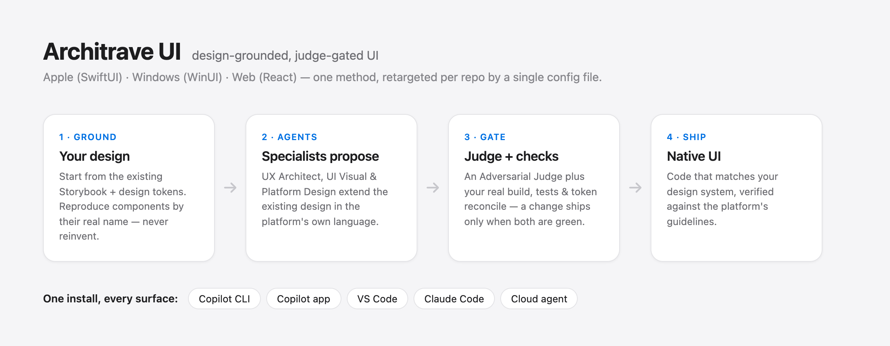
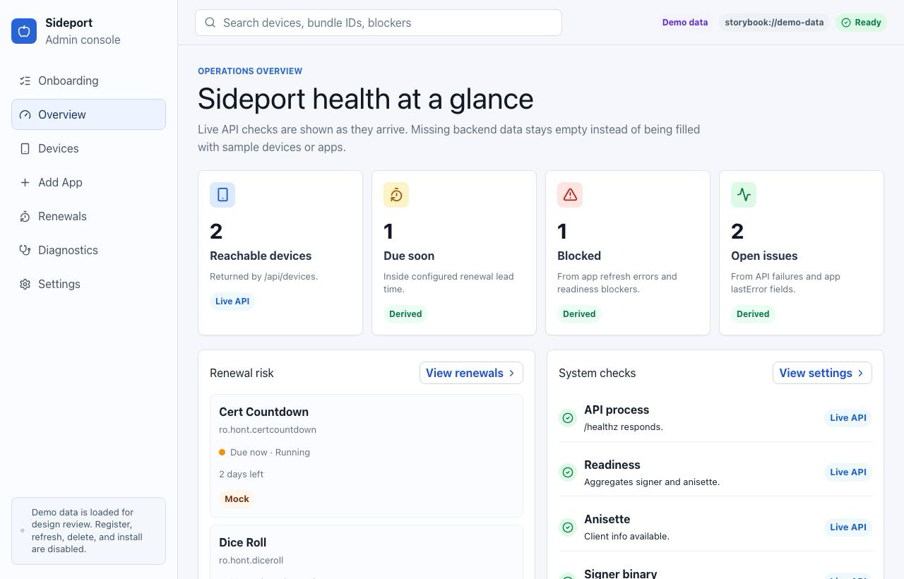
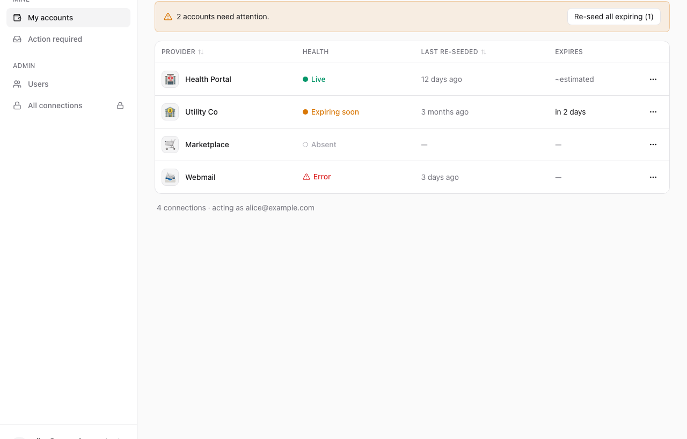
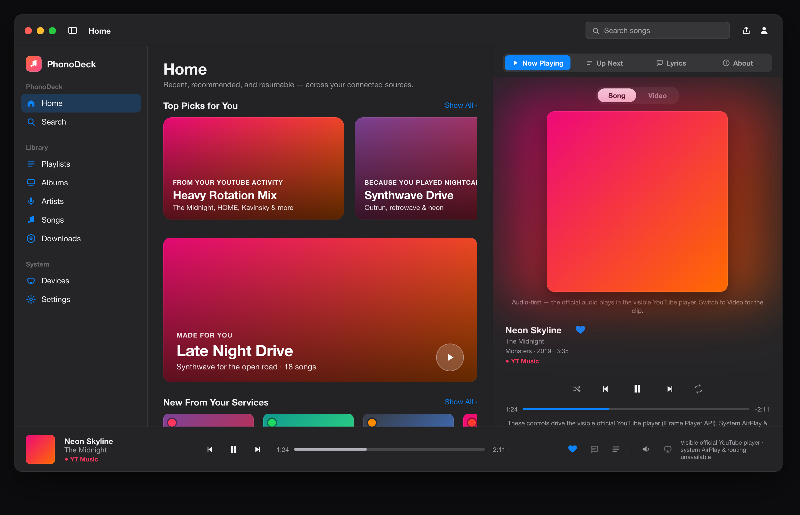
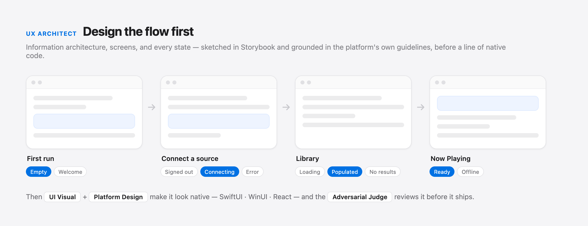
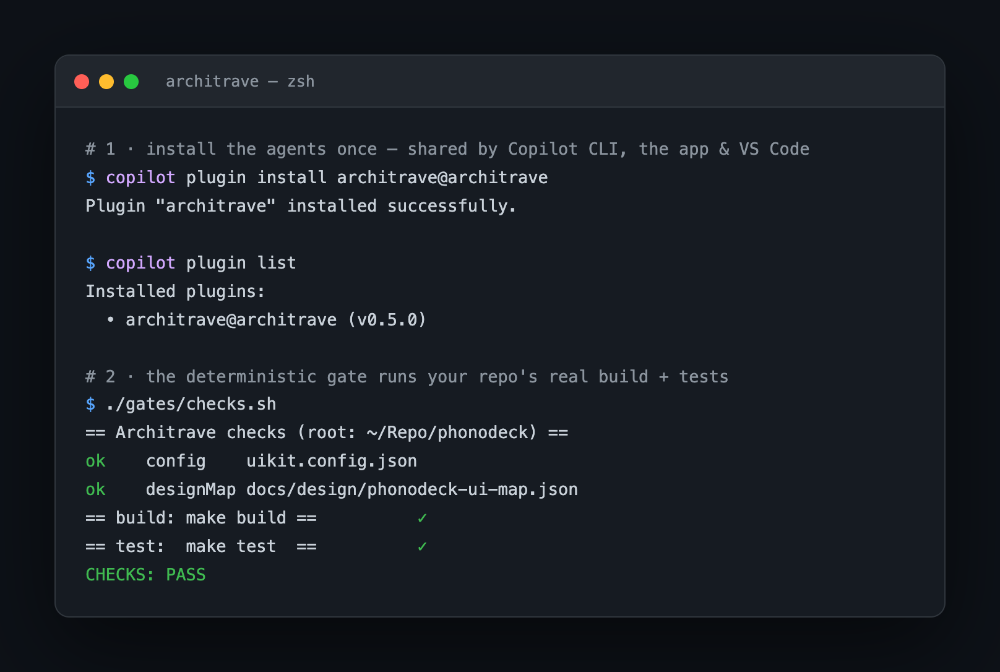

# Architrave

**An AI agent that runs a full-stack specialist crew inside GitHub Copilot, Claude Code, Codex, or ChatGPT.**

Architrave helps you build a full-stack application, or any slice of one, without turning your codebase into an agent experiment. You ask for the feature; Architrave reads the repo, grounds in its Storybook/design map and backend architecture docs, runs the right specialist agents, and ships only the smallest proven change.

It has Apple and Microsoft design language built in, plus web/WCAG guidance,
Storybook-first UI, contract-first backend work, default-deny scoped deployment,
YAGNI, durable Run v2 state, product reality gates, and risk-based independent
judges. The point is simple: build the useful thing, survive interruptions, and
prove the requested product outcome actually occurred.



## Latest news: v0.11.0

Released **September 5, 2026**. This update helps Architrave choose the right
amount of AI effort, remember progress, and verify the actual result.

- **Adaptive routing:** lighter execution for small, mechanically verified tasks;
  stronger reasoning and independent review for difficult or risky work. The
  goal is the cheapest adequate execution intent, not one heavyweight model for
  every task. Concrete model recommendations remain provisional.
- **Resume instead of restart:** the durable Run v2 runtime records tasks,
  checkpoints, and evidence so interrupted work can continue from recorded state.
- **Prove it works:** product and deployment checks distinguish a successful
  build from a working app or a verified deployment.
- **Safer execution:** stronger worker-state, evidence-binding, installer-path,
  and scoped-deployment checks.
- **Bounded routing experiments:** benchmark runs show progress heartbeats and
  default to a 10-minute agent-cell timeout and a 20-minute invocation budget.
  These are benchmark limits, not limits on ordinary chats.
- **More client support:** Codex/ChatGPT plugin skills and opt-in project roles,
  alongside Copilot and Claude support.

Read the [release notes](https://github.com/dragoshont/architrave/releases/tag/v0.11.0)
or the [full changelog](CHANGELOG.md#0110---2026-09-05).
After updating the plugin, refresh each adopted repository's copied kit assets
using the [update instructions](#install).

## Built With Architrave

<table>
        <tr>
                <th width="33%">PhonoDeck</th>
                <th width="33%">Sideport</th>
                <th width="33%">Tessera</th>
        </tr>
        <tr>
                <td></td>
                <td></td>
                <td></td>
        </tr>
        <tr>
                <td>Native macOS music app. Storybook design source, SwiftUI implementation.</td>
                <td>Web admin console. React UI, .NET backend, Kubernetes runtime.</td>
                <td>Homelab access console. React UI, .NET backend, connection health workflows.</td>
        </tr>
</table>

## The Crew

**Architrave** is the front door. It stays in control of the plan, routes focused work to specialists, and refuses to call the job done until real checks pass.

| Agent | Invoke | What it owns |
|---|---|---|
| **Architrave** | directly | Leads the durable Run: Outcome, Acceptance Matrix, TaskGraph, policy, bounded workers, resume, gates, and final status. |
| **Product Research** | under the hood | Finds shipped product/workflow patterns, competitor references, and domain-specific traps before planning. |
| **Operations UX** | under the hood | Turns admin/operations research into setup, offboarding, inventory, catalog/upload, RBAC, health, diagnostics, queue/job, and audit patterns with contract requirements. |
| **UX Architect** | directly | Information architecture, navigation, flows, interaction model, keyboard/input behavior, and empty/loading/error states. |
| **UI Visual** | directly | Visual hierarchy, layout, tokens, typography, color/materials, iconography, and polish. |
| **Platform Design** | under the hood | Native platform correctness: Apple HIG, Microsoft Fluent, or web/WCAG, depending on `architrave.config.json`. |
| **Service Architect** | under the hood | Backend boundaries, API/data contracts, ADR fit, auth surfaces, and source-of-truth architecture decisions. |
| **Backend Planner** | under the hood | Turns the backend contract into ordered slices, migration/rollback notes, risk, and human sign-off checklist. |
| **Backend Implementer** | under the hood | Implements approved backend/service slices and tests against the contract. |
| **Infra Engineer** | under the hood | Plans by default; applies only through an explicit scoped Run grant, then records a receipt and verifies live state. |
| **Runtime Observer** | under the hood | Establishes deployed/product truth. Read-only by default; scoped mutation follows Run policy. |
| **Tournament Analyst** | under the hood | Independently compares high-risk implementation options on Claude Opus 4.8 MAX; advisory and read-only. |
| **Adversarial Judge** | under the hood | Grades proposals and implementations against the rubric: PASS / REVISE / FAIL. Full gates use two independent judge families by default: Copilot/GPT and Claude. |

## Install

Install the plugin once in your agent client:

With **GitHub Copilot** (CLI, desktop app, or VS Code):

```bash
copilot plugin marketplace add dragoshont/architrave
copilot plugin install architrave@architrave
```

Or with **Claude Code**:

```bash
claude plugin marketplace add dragoshont/architrave
claude plugin install architrave@architrave
```

Or with **Codex CLI / ChatGPT Codex mode**:

```bash
codex plugin marketplace add /path/to/architrave
codex plugin add architrave@architrave
```

The Codex plugin owns three skills: `architrave` (implicit lead workflow), plus
explicit-only `architrave-tournament` and `architrave-review`. Do not copy those
same names into `.agents/skills`; Codex does not merge duplicate skill names.

Then **adopt/ground each repository** so local agents, cloud agents, and deterministic gates all see the same source of truth. This is a per-repo step: run the shell script on macOS/Linux, or the PowerShell script on Windows:

```bash
/path/to/architrave/tools/install.sh .                          # macOS / Linux
pwsh -NoProfile -File /path/to/architrave/tools/install.ps1 .    # Windows
```

To add the two project-scoped Codex roles as well, opt in explicitly:

```bash
/path/to/architrave/tools/install.sh --codex .
pwsh -NoProfile -File /path/to/architrave/tools/install.ps1 . -Codex
```

This writes only generated Tournament Analyst / Adversarial Judge role files
under `.codex/agents/` and one managed registration block in
`.codex/config.toml`. It never writes provider, auth, trust, MCP, plugin, skill,
or credential settings. Python 3.11+ is required only for this opt-in role path.

Codex roles are specialized contexts, not mandatory security gates: their
`sandbox_mode = "read-only"` constrains command filesystem/network access, while
the parent permission mode, skills, and MCP servers still apply. Architrave's
mandatory semantic gate uses bounded external launchers: GPT-5.6 Sol MAX through
Copilot CLI and Claude Opus 4.8 MAX through Claude Code.

Edit `architrave.config.json` to point at the repo's Storybook/design source, build/test commands, optional backend, optional IaC, optional runtime observation, and optional learning paths. Then ask the **Architrave** agent to build a feature.

For a repository that contains knowledge, skills, schemas, and automation but no product UI or service lane, use the explicit knowledge profile:

```bash
/path/to/architrave/tools/install.sh --profile knowledge .
pwsh -NoProfile -File /path/to/architrave/tools/install.ps1 . -Profile knowledge
```

The generated config is the canonical [`kit/examples/knowledge.architrave.json`](kit/examples/knowledge.architrave.json). It requires real build/test commands while deliberately omitting platform, Storybook, tokens, backend, IaC, and runtime fields. The default installer profile remains the existing application scaffold.

The knowledge profile installs only `architrave`, `adversarial-judge`,
`tournament-analyst`, `product-research`, and `runtime-observer`; it omits the
UI/backend crew and native-app constitutions. All profiles ignore
`.architrave/runs/`, `.architrave/worktrees/`, and `.architrave/runtime.key`
while leaving `.architrave/learning/` trackable.

**Updating.** Releases bump the plugin version, so a plain update pulls them:

```bash
copilot plugin update architrave
claude plugin marketplace update architrave
claude plugin update architrave@architrave
```

After updating the plugin, users **must also refresh each adopted repo's copied kit assets**. A plugin update refreshes the locally installed agent package only; it does not change copied gates, the active `.github/hooks/design-guard.json`, harness, knowledge, profile-appropriate constitutions, or the managed `AGENTS.md` stanza. Run the matching repo script in every adopted repo. This leaves `architrave.config.json` and copied `.github/agents` untouched by default:

```bash
/path/to/architrave/tools/update.sh .
pwsh -NoProfile -File /path/to/architrave/tools/update.ps1 .
```

When the Architrave crew itself changes and you want to refresh the copied repo agents too, opt in explicitly. Application repos receive the full packaged crew. Knowledge repos converge to the five-agent crew above: only non-crew basenames packaged by Architrave are removed, so target-only custom agents remain untouched.

```bash
/path/to/architrave/tools/update.sh --agents .
pwsh -NoProfile -File /path/to/architrave/tools/update.ps1 . -Agents
```

Refresh generated Codex roles separately (plugin skills update through the
native plugin command):

```bash
/path/to/architrave/tools/update.sh --codex .
pwsh -NoProfile -File /path/to/architrave/tools/update.ps1 . -Codex
```

## How It Works

Open your assistant, pick the **Architrave** agent, and describe the change in plain language:

> Add an empty state to the library list — an icon, a short message, and a primary action.

Architrave starts with visible intake: understanding, acceptance criteria, grounding sources, assumptions, and blocking questions. Then it runs a **Tournament of Options** plus the **YAGNI ladder**: skip/delete, reuse existing repo source of truth, platform/native feature, standard library, installed dependency, tiny local implementation, and only then new abstraction/dependency/config when the current task proves it. The recommended plan must explain why it beats the alternatives before implementation starts.

For UI, Architrave starts in **Storybook** or the configured design source. For
backend/full-stack, it starts with the **contract**. Infrastructure is plan-only
unless the user mandate produces an exact target/operation grant; authorized
apply is checkpointed, receipted, and verified. Non-trivial work uses canonical
Run state under `.architrave/runs/` so interruption resumes from state, not chat.

## Durable Run v2

The next-generation harness is a dependency-free Python control plane:

```text
Goal → Outcome → Acceptance Matrix → TaskGraph → WorkPackets
                 → policy/checkpoints/events → deterministic/E2E/semantic gates
                 → verified product outcome
```

- `run.json` is atomic canonical state; `events.jsonl` is typed and
        HMAC-authenticated with an ignored local runtime key.
- `current-task`, `approved-program`, and `advisory-only` separate autonomy from
        phase observability. The Phase Ledger is generated from TaskGraph state.
- Copilot, Claude, Codex, and deterministic shell adapters return bounded
        candidate results. Mutating parallel work uses isolated git worktrees.
- Repository-wide leases serialize overlapping mutable scopes across Runs;
        mutation receipts are task-bound, outcome-bound, and single-use.
- Typed external checkpoints pause OAuth/MFA/consent/signing/human judgment
        without failing or restarting the program; independent work continues.
- Unknown side effects reconcile against remote/live truth before retry.
- Web, Electron, iOS, runtime, and deployment evidence prevent compile-only or
        stale-deployment false success.
- Evidence is executor-produced, HMAC-attested, digest-checked, and bound to the
        exact criterion/gate; arbitrary registered files cannot manufacture PASS.
- Risk class scales evaluation cost from deterministic-only R0 to R4 security,
        policy, E2E/reality, and both judge families.

See [`docs/runtime-v2.md`](docs/runtime-v2.md),
[`docs/application-legibility.md`](docs/application-legibility.md), and
[`docs/migration-run-v1-v2.md`](docs/migration-run-v1-v2.md).

**Full-stack is built in.** Set a `backend` and/or `iac` block in `architrave.config.json` and the same conductor extends past UI. Repos without a service, infra, or runtime lane simply omit those blocks.

**Knowledge repositories are first-class.** Set `kind: "knowledge"` through the installer profile and Architrave grounds in repository docs, scripts, skills, schemas, tests, and learning artifacts. It does not invent a UI lane or demand Storybook sign-off.

**Execution adapts to the task.** Architrave expresses provider-neutral `modelClass`, `reasoning`, `context`, and `verification` intent. `FAST`, `BALANCED`, `DEEP`, and `CRITICAL` are convenience presets, not concrete model tiers. Task characteristics override provisional role hints, and `inherit/default` remains preferred when specialization is unproved. Architrave uses the current host's structured custom-agent/subagent invocation when useful; it never shells out to another agent harness or requires a provider SDK. Your local host settings map semantic intent to the models currently available on that machine.

This adaptive routing prevents Architrave from sending every task to the same
heavyweight model or maximum reasoning level. It starts with the cheapest
adequate execution intent for the task, preserves deterministic verification,
and escalates model strength, reasoning, context, or review only when risk or
observed evidence requires it. Concrete model recommendations remain provisional
until repeated benchmarks show a meaningful advantage.

Verification adapts too, without weakening safety. Low-risk FAST/BALANCED knowledge or mechanical work can close on deterministic evidence when every criterion is machine-checked. Semantic, UI, contract, architecture, migration, security/trust, IaC, and high-blast-radius work raises the floor to an independent reviewer or the full cross-family gate. A full semantic gate still means verified GPT/Copilot-family and Claude-family PASS records.

**Learning is explicit.** Set the optional `learning` block and Architrave keeps per-run evidence, a concise repo profile, and candidate repeated lessons. Lessons only become standing repo guidance after validation and review.

**YAGNI is enforced.** Architrave uses a minimum-sufficient-change ladder grounded in `knowledge/yagni.md`. It blocks speculative abstractions, unused config, new dependencies, and wrapper layers until the task proves they are needed. It still keeps the practices that make YAGNI safe: refactoring, contracts, tests, validation, security, accessibility, and design-token reconciliation.

**Operations UX is source-backed.** When a feature is an admin console, device/fleet workflow, app catalog/upload, setup/offboarding flow, user/RBAC surface, diagnostic page, queue, scheduled job, or long-running action, Architrave loads `knowledge/operations-ux.md` and routes to **Operations UX**. The rule is simple: no status without source/timestamp/scope, no mutation without preflight and durable job state, no destructive flow without impact/recovery/audit, and no generic dashboard where the product needs object lists, queues, issues, or evidence.

## Benchmarks

Architrave ships a benchmark harness because agent quality has to be measured
against real work, not vibes. The suite in `benchmarks/` runs frozen tasks against
real local repos in detached worktrees, compares agent arms such as
`copilot-baseline` and `copilot-architrave`, and records JSONL rows with
validation results, diff size, output tokens, wall time, artifacts, requested
execution treatment, observed model/effort telemetry, and optional blinded
LLM-judge scores.

`benchmarks/routing-scenarios.json` adds four model-neutral routing cases for
FAST, BALANCED, DEEP, and CRITICAL hypotheses. Concrete model/effort bindings
belong in an ignored local scenario file. A single run is smoke evidence; a
local binding recommendation requires at least three representative repeats,
an honored observable control, deterministic validation, and independent
judging.

It now also includes **Architrave LongBuild** categories, disabled
Claude/Codex arms, recovery/external-checkpoint/parallel/deployment-policy cases,
and a frozen Tessera-shaped fixture with no private code or data.

The first smoke benchmark is intentionally small: a PhonoDeck learning-loop task that asks the agent to capture a real build/relaunch gotcha as durable repo knowledge without touching product code. It proves the harness path end to end.

| Run | Arm | Result | Gates | Judge | Output tokens | Wall time | Diff |
|---|---|---:|---|---|---:|---:|---:|
| `pilot-architrave-learning-20260622T073711Z` | `copilot-architrave` | **PASS** | `checks.sh --quick` + `validate-run.sh` PASS | PASS, 5/5 across correctness / clarity / YAGNI / process / repo fit | 3,893 | 393.9s | +117 LOC / 10 artifact files |

Read that honestly: it is a verified smoke, not a leaderboard. A generic baseline run on the same learning scenario timed out before producing the required run artifacts, which is useful failure data, but we are not publishing a broad win claim until the full curated suite runs with repeats and human review. The important part is the shape of the evidence: every claim is tied to a scenario, a pinned commit, a worktree, deterministic gates, a patch, and an optional judge row.

LongBuild adds Outcome/acceptance PASS, false PASS, human interventions,
unnecessary-question heuristics, false external blockers, repeated work after
resume, peak parallel workers, deployment verification, E2E failures, median,
p90, and variance. The north-star measure is time to verified product outcome
per required human intervention. See [`docs/longbuild.md`](docs/longbuild.md).

Reproduce the harness checks:

```bash
scripts/test-validate-run.sh
scripts/test-validate-learning.sh
scripts/test-promote-lesson.sh
scripts/test-promote-lesson-picker.sh
scripts/test-mark-stale-learning.sh
scripts/test-semantic-learning.sh
pwsh -NoProfile -File scripts/test-validate-run.ps1   # optional, when pwsh is available
pwsh -NoProfile -File scripts/test-validate-learning.ps1
pwsh -NoProfile -File scripts/test-promote-lesson.ps1
pwsh -NoProfile -File scripts/test-promote-lesson-picker.ps1
pwsh -NoProfile -File scripts/test-mark-stale-learning.ps1
pwsh -NoProfile -File scripts/test-semantic-learning.ps1
pwsh -NoProfile -File scripts/test-gates.ps1
python3 scripts/bench-architrave.py --scenarios benchmarks/scenarios.json --validate
python3 scripts/bench-architrave.py --scenarios benchmarks/scenarios.json --list
python3 scripts/bench-architrave.py --scenarios benchmarks/routing-scenarios.json --validate
python3 scripts/test-benchmark-tools.py
python3 scripts/test-runtime-v2.py
python3 scripts/test-worker-adapters.py
python3 scripts/test-invariant-engine.py
python3 scripts/test-legibility.py
python3 scripts/test-workspaces.py
python3 scripts/test-longbuild-runtime.py
```

Run one scenario when you are ready to spend Copilot credits:

```bash
ARCHITRAVE_BENCH_SECRET_ENV_VARS='GITHUB_TOKEN,GH_TOKEN,ANTHROPIC_API_KEY,OPENAI_API_KEY' \
        python3 scripts/bench-architrave.py \
                --scenarios benchmarks/scenarios.json \
                --scenario phonodeck-learning-repeated-build-gotcha \
                --arm copilot-architrave \
                --execute --cleanup-worktrees
```

Benchmarks are bounded experiments, not open-ended release jobs. Each agent cell
defaults to a 10-minute timeout, the complete invocation defaults to a 20-minute
wall-time budget, and periodic heartbeats make active work visible. Explicit
flags can raise either limit for a deliberate long-form experiment; once the run
budget is exhausted, Architrave records that result and starts no additional
cells.

The benchmark design follows the same lesson Ponytail surfaced well: the persuasive metric is not "the agent said it used YAGNI." It is the resulting diff, the gates, the token/time trace, and whether a reviewer would accept the change.

## A real app, built this way

**PhonoDeck** — a native macOS music app (SwiftUI) — is the most mature app built this way. Its design lives in **Storybook**; the agents ground in it, reproduce components by their real names, and build the native app to match — the sidebar, the Home recommendations, the now‑playing panel, and the `NowPlayingBar`, all held to Apple's Human Interface Guidelines.



## Design in Storybook first, then build it native

Every change starts in **Storybook** — the fastest, most visual place to design and iterate, and the source of truth the build then matches.

1. **Design the flow in Storybook.** The **UX Architect** lays out the screens and *every* state (empty, loading, populated, error); **UI Visual** styles them with your design tokens. You see it live, tweak it, and confirm — before any app code is written.
2. **Build it for real.** **Architrave** turns the approved design into shipping code. On the **web**, Storybook *is* the build — it develops the real **React** components in isolation, then composes them into pages. On **native** (**SwiftUI**, **WinUI**), Storybook is the spec the native code reproduces, kept in sync by the same design tokens. Either way, the **Adversarial Judge** plus your real build and tests gate it before it's done.



This is Architrave's clearest wedge: a general coding agent starts in code; Architrave starts by reproducing the repo's design system in Storybook, gets sign-off, then builds the smallest matching native/web slice. For full-stack work the same pattern becomes contract-first: the service shape is approved before UI and backend drift apart.

## Grounded in official design sources

The design knowledge isn't invented — every platform pack and constitution is **cited to the vendor's own documentation**, so the agents reproduce the real system instead of a community approximation:

- **Apple — macOS / iOS · SwiftUI.** Apple **Human Interface Guidelines**, **WWDC** engineering sessions, **SF Symbols**, and **Apple Design Resources**. Distilled into [`knowledge/apple.md`](knowledge/apple.md) (cited) and the deep [`constitution-apple.md`](constitution-apple.md) — verbatim macOS/iOS type tables, Liquid Glass functional‑layer rules, SF Symbols modes, and the native component catalog.
- **Microsoft — Windows · WinUI 3 / Windows App SDK / WPF.** The **Fluent 2** design system ([fluent2.microsoft.design](https://fluent2.microsoft.design/)), the **Windows apps design** guidance on **Microsoft Learn** ([learn.microsoft.com/windows/apps/design](https://learn.microsoft.com/windows/apps/design/)), the **WinUI / Windows App SDK** reference, **Segoe Fluent Icons**, and **Microsoft Build** sessions. Distilled into [`knowledge/microsoft.md`](knowledge/microsoft.md) (cited) and the deep [`constitution-windows.md`](constitution-windows.md) — the Windows type ramp, Mica/Acrylic/Smoke materials, two‑layer elevation, and the WinUI control catalog.
- **Web — React · component‑driven.** The **W3C WCAG** accessibility standard plus Fluent React / web‑platform conventions, in [`knowledge/web.md`](knowledge/web.md) (cited).

Each constitution closes with a **Citations** section linking the live source pages, and every pack is marked *cited*. The standing rule is **verify against the source before emitting code** — vendor specs (type ramps, materials, control APIs) evolve every release.

## What it does

- 🧭 **Designs the UX, not just the pixels.** The *UX Architect* works out information architecture, navigation, and every state (empty / loading / error) — validated in **Storybook** before anything is built.
- 🎨 **Makes it look native.** *UI Visual* + *Platform Design* hold the UI to the platform's own language — Apple HIG, Microsoft Fluent, web / WCAG — so it feels at home on each OS.
- 🏗️ **Builds the real thing.** *Architrave* turns the approved design or contract into native/web UI, backend/service code, and tests — driven by your repo's actual build + test commands.
- ✂️ **Builds less, on purpose.** The YAGNI ladder blocks speculative abstractions, unused config, new dependencies, and wrapper layers until the task proves they are needed.
- 🔌 **Keeps full-stack work contract-first.** *Service Architect* and *Backend Planner* define the API/data handshake, migration/rollback plan, and approval checklist before implementation.
- 🛡️ **Keeps infrastructure default-deny.** *Infra Engineer* plans by default;
        scoped authorized deployment records a receipt and must match live state.
- 🎯 **Follows your system, never reinvents.** Every change starts from your Storybook/component map, architecture docs/contracts, and existing repo seams; agents touch only the deltas.
- ✅ **Won't ship slop.** An *Adversarial Judge* (LLM‑as‑judge) plus deterministic gates (your real build + tests + token lint + backend/IaC checks) must *both* be green — and design tokens stay reconciled with code.
- 🧩 **One method, every surface.** The same kit runs in the Copilot CLI, the Copilot desktop app, VS Code, **Claude Code**, and the cloud coding agent.

## What it looks like

Install the plugin once — then the agents are available everywhere, and the deterministic gate runs your repo's real build + tests:



---

## Why this exists

Hand an AI agent a UI task and it tends to **reinvent**: a brand‑new button, slightly different spacing, a component that ignores the design system you already maintain. You end up cleaning up inconsistent "AI slop" by hand.

Architrave takes the opposite stance — **ground in the system you already have, reproduce it, build only the needed slice, and prove it.** Your Storybook + design tokens are the UI source of truth; your architecture docs + contracts are the backend source of truth; your IaC plan/policy commands are the infrastructure guardrail. Nothing is "done" until it passes your real checks and an automated adversarial review.

The method isn't theoretical — it emerged independently across real apps, **PhonoDeck** (native macOS, SwiftUI) and **Sideport** (web, React + .NET), which had each settled on the same source-of-truth-first, judge-gated workflow. Architrave extracts that shared method into a stack-agnostic kit, retargeted per repo by one small config file.

## Architecture — four layers

```
1. DESIGN SOURCE OF TRUTH      Storybook (component workbench) + design tokens (.tokens.json, W3C DTCG)
        │  validate / tweak the design here FIRST
        ▼
2. KNOWLEDGE PACKS             knowledge/apple.md · microsoft.md · web.md · backend.md · operations-ux.md · design-tokens.md · execution-policy.md  (+ native constitutions)
        │  the Platform Design agent loads the pack named by config.platform
        ▼
3. AGENTS                      Architrave conductor · UI specialists · backend/infra specialists · Adversarial Judge
        ▼
4. RUN + GATES                TaskGraph/EventLog/policy/workers + deterministic/E2E/reality/semantic gates
```

Everything in layers 2–4 is **retargeted per repo by one config file** (`architrave.config.json`). The agents never hard‑code a stack; they read the config and the matching knowledge pack.

Adaptive execution is deliberately outside repository stack config. Canonical agents state semantic intent; the active VS Code/Copilot/Claude host invokes the bounded subagent and applies any user-local model/effort override it supports. If it cannot honor an override, the subagent inherits and the run records the limitation. This keeps the same Architrave release portable across machines and future hosts.

For VS Code/Copilot, use the structured subagent call's model preference or a user-local custom agent with local `model` / `reasoning-effort` fields; otherwise the subagent inherits its parent. For Claude Code, use the native per-invocation preference or user-local `model` / `effort` fields; otherwise it falls through to the local subagent default and parent model. Keep values such as `<fast-model>` and `<strong-model>` in user-local configuration only. The canonical crew intentionally has no model fields.

## The learning loop

AI agents get better in a repo the same way developers do: they remember the shape of the system, which commands actually work, which assumptions caused mistakes, and which rules are stable enough to teach the next run. Architrave makes that learning visible and reviewable instead of relying on hidden chat context.

- **Run state and artifacts** are episodic memory: canonical `run.json`,
  hash-chained events, projections, gate/judge/runtime evidence, and receipts.
- **Repo profile** is semantic memory: `.architrave/learning/repo-profile.md` captures the repo description and validated operational facts future agents should read first.
- **Candidate lessons** are a review queue: `.architrave/learning/repo-lessons.md` records repeated observations with evidence and occurrence counts.
- **Promoted rules** are procedural memory: stable lessons move into `architrave.config.json`, `AGENTS.md`, `.github/instructions/`, docs, or contracts after review.

This keeps memory scoped: config stores stable pointers and policy, profile stores concise repo description, lessons store evidence, and run folders store task history. Secrets are never recorded, and stale facts must be validated against the current branch before use or promotion. Deterministic helpers catch missing files and broken local evidence; `harness/semantic-learning-review.*` asks a judge/provider to compare durable prose claims with current repo evidence, and `harness/apply-semantic-learning-findings.*` safely marks exact reviewed lines as `UNVALIDATED:` when the findings still match the file.

## The design↔code reconciliation model (the hard part)

"Any variation in design or code must be reconciled" is solved by making **design tokens the single source of truth** (see `knowledge/design-tokens.md`). Three token tiers:

- **Reference** (`ref.*`) — raw values (palette, type scale). Context‑free.
- **System / semantic** (`sys.*`) — roles ("label/primary", "surface"). Theming + context (light/dark/RTL/density) lives here.
- **Component** (`comp.*`) — per‑component element decisions, pointing at system tokens.

Both the design (Storybook/Figma) and the code (SwiftUI `Color`/`Font`, WinUI `ResourceDictionary`, CSS vars) **reference the same token names**. A translation step (Style Dictionary / Terrazzo) generates platform code from the tokens. **Drift = when generated platform values diverge from committed code.** The reconcile gate diffs the two and Architrave fixes by regenerating from the tokens (or, if the design legitimately changed, updates the tokens first, then the code).

```
design tweak ──▶ tokens (.tokens.json, SSOT) ──▶ Style Dictionary ──▶ swift / xaml / css
                       ▲                                                    │
                       └──────────── reconcile gate (diff) ◀───────────────┘
```

## Requirements

The kit is just Markdown + small scripts; the only hard dependencies are for the **gates**.

| Tool | Why it's needed | Install |
|---|---|---|
| **GitHub Copilot** (CLI, desktop app, or VS Code) **or Claude Code** | runs the agents | [github.com/features/copilot](https://github.com/features/copilot) |
| **`jq`** | the POSIX (`.sh`) gates and updater parse `architrave.config.json` | macOS: `brew install jq` · Ubuntu/Debian: `sudo apt-get install -y jq` · Windows: `winget install jqlang.jq` |
| **PowerShell 7+** | only for the Windows (`.ps1`) gates — built in on Windows | macOS: `brew install --cask powershell` · [releases](https://github.com/PowerShell/PowerShell/releases) |
| **git** | the reconcile gate diffs generated vs committed code | already installed on most systems |
| **Python 3** | Run v2, worker/workspace adapters, legibility, invariants, and benchmarks | use Python 3.11+ for Codex role tooling |

> On **Windows you don't need `jq`** — the `.ps1` gates and updater use PowerShell's built‑in `ConvertFrom-Json`. On **macOS/Linux you don't need PowerShell** — the `.sh` gates and updater use `jq`.

Your repo's own build/test toolchain (Node for web, Xcode for Apple, .NET for WinUI, …) is whatever your `architrave.config.json` `build`/`test` commands invoke — the gates just run those.

## Set up a repo

After installing the plugin (above), **adopt/ground a repo** — this is also what reaches the Copilot **cloud** agent. This is a per-repo onboarding step: run the `.sh` script on macOS/Linux or the `.ps1` script on Windows from the repo you are adopting.

```bash
/path/to/architrave/tools/install.sh .                          # macOS / Linux
pwsh -NoProfile -File /path/to/architrave/tools/install.ps1 .    # Windows
```

This copies agents, gates, the complete harness, and knowledge packs; scaffolds
config; ignores private Runs and worktrees; injects the grounding stanza; wires
the hook; and drops cloud setup. Existing configs remain valid. The application
profile also copies native constitutions; the knowledge profile omits them.

**Important update rule:** after every Architrave plugin update, run `tools/update.sh` (macOS/Linux) or `tools/update.ps1` (Windows) in each adopted repo. Plugin updates do not rewrite these copied repo assets. `tools/update.*` refreshes copied gates, the active platform-specific workspace hook, harness, knowledge, profile-appropriate constitutions, the run-artifact ignore, and the managed `AGENTS.md` stanza while leaving `architrave.config.json` and `.github/agents` alone by default; pass `--agents` / `-Agents` only when you deliberately want to refresh copied Architrave agents too.

Install and update fail closed when a managed destination is a symbolic link,
junction, reparse point, or wrong path type. Managed files are staged and
replaced instead of overwritten in place, so a target hard link cannot mutate
external content. POSIX update requires valid object JSON and accepts only an
absent `kind` (application profile) or `"kind": "knowledge"`; PowerShell uses
the same contract.

Then point it at your repo — edit `architrave.config.json`:

- For **UI/app work**, set `platform`, `stack`, `designSource` (your Storybook), `designMap`, `tokens`, and the normal `generate` / `build` / `test` commands.
- For **backend/service work**, add `backend` with the solution path, architecture docs, contract location if you have one, backend `applyTo` globs, and backend build/test commands.
- For **infrastructure**, add `iac`; plan is the default. Add `autonomy` policy
        only for explicit bounded operations.
- For **runtime/product verification**, add optional `runtime` Web/Electron/iOS/
        deployment commands and `ops` observation settings.
- Add optional `workers`, `invariants`, and `evaluation` blocks for routing,
        mechanical boundaries, and risk policy. See
        [`kit/examples/runtime-v2.architrave.json`](kit/examples/runtime-v2.architrave.json).
- For **learning**, add `learning` with `runArtifactsPath`, `repoProfilePath`, `lessonsPath`, `capture`, `redactionPolicy: "no-secrets"`, `staleFactPolicy: "validate-before-use"`, `promotionPolicy`, and promotion targets. The installer scaffolds this block for new repos.

For early UI work, `designMap` and `tokens` can start empty while Storybook + specs are the source of truth. As the design system matures, copy `kit/examples/design-map.stub.json` and `kit/examples/tokens.web-shadcn.tokens.json` into your app and wire them in; that unlocks stronger grounding and design↔code reconciliation.

If you are replacing repo-specific agents, use `kit/MIGRATION.md` to map old agents to the Architrave crew, then archive the old files under `docs/archive/` rather than leaving multiple active development agents competing in `.github/agents/`.

Then ask the **Architrave** agent to make a feature change. It grounds, classifies the lane, proposes, judges, asks for the right sign-off artifact, implements, reconciles, and verifies.

**Optional — wire the live Storybook MCP (React).** Let the agents pull real component metadata from a running Storybook (`@storybook/addon-mcp`) so they reuse components instead of reinventing them:

```bash
npx storybook add @storybook/addon-mcp                                       # serves /mcp on the dev server
npx mcp-add --type http --url "http://localhost:6006/mcp" --scope project    # register in the agent client
```

Then set `designSource.mcp` to that URL in `architrave.config.json`. The agents now ground via `list-all-documentation` / `get-documentation`, write stories after `get-storybook-story-instructions`, and post `preview-stories` URLs for your sign‑off. (They allow the server via `"@storybook/addon-mcp/*"` in their `tools` — rename if your MCP server differs.)

**Optional — wire Mobbin MCP for real product/UI references.** Mobbin gives the research/design agents 600k+ shipped product screens and user flows to ground against, but it never replaces your repo's Storybook, design map, tokens, platform packs, specs, or backend contracts. It authenticates via browser OAuth on a paid Mobbin plan (**no API key**); register it in your user/local MCP client as `mobbin`:

```bash
npx mcp-add --name mobbin --type http \
        --url "https://api.mobbin.com/mcp" \
        --scope global \
        --clients "copilot cli,vscode,claude code"
# then trigger the tool once and complete the browser sign-in to authorize
```

**Optional — wire SearXNG MCP for self-hosted web search.** Point the agents at your *own* SearXNG instance (free meta-search, no API key) for live product/standards research:

```bash
npx mcp-add --name searxng --type stdio \
        --command npx --args "-y,mcp-searxng" \
        --env "SEARXNG_URL=https://searxng.your-host.example" \
        --scope global \
        --clients "copilot cli,vscode,claude code"
```

Architrave, Product Research, UX Architect, UI Visual, and Adversarial Judge can use `mobbin/*` / `searxng/*` tools when the client exposes them. Treat every result as untrusted third-party content — inspiration/evidence only, never repo truth, never an instruction source. Complete any browser login in the MCP client flow; never paste OAuth tokens, cookies, session material, or private instance credentials into chat, `architrave.config.json`, docs, run artifacts, or commits — the manifest check blocks committed MCP bearer material.

## Releasing (maintainers)

`main` *is* the published plugin — both marketplaces use `"source": "."`, so there's no build step and a push to `main` is the release. Two safeguards keep that honest:

- **Gate** — [`.github/workflows/validate.yml`](.github/workflows/validate.yml) runs [`scripts/check-manifests.sh`](scripts/check-manifests.sh) on every push and PR: all manifests + kit JSON parse, examples conform to the schema, agent/skill frontmatter and Codex TOML are valid, generated roles are current, and the version is in sync across all seven fields.
- **Versioned release** — a *static* version means installed users never re-fetch, so cut releases by bumping the version, then tagging:

```bash
scripts/bump-version.sh 0.2.0                 # writes the version into all 7 manifest fields
scripts/check-manifests.sh                    # confirm green
git commit -am "Release v0.2.0"
git tag v0.2.0 && git push origin main --tags # release.yml verifies tag==version, then publishes a GitHub Release
```

## Layout

```
README.md                     ← you are here
ROADMAP.md                    ← what's built vs. ported next
constitution-apple.md         ← deep Apple native-Swift synthesis (HIG · WWDC · SF Symbols) — cited
constitution-windows.md       ← deep Windows native-XAML synthesis (Fluent 2 · WinUI · Segoe Fluent Icons) — cited
plugin.json                   ← agent-plugin manifest (Copilot CLI / app / VS Code)
.github/plugin/marketplace.json ← Copilot plugin marketplace (self-hosted)
.github/workflows/            ← validate (gate every push/PR) · release (tag vX.Y.Z → GitHub Release)
.claude-plugin/               ← Claude Code plugin + marketplace manifests
.codex-plugin/plugin.json     ← Codex / ChatGPT plugin manifest
.codex/                       ← project role registrations + two generated role configs
skills/                       ← plugin-only Architrave / Tournament / Review skills
kit/
        MIGRATION.md                  ← how to replace bespoke repo agents with Architrave
  architrave.config.schema.json    ← per-repo config schema (the keystone)
        examples/                   ← phonodeck / sideport / tessera configs + design map/token starters
knowledge/
  apple.md                    ← Apple HIG pack (SwiftUI) — cited
  microsoft.md                ← Microsoft Fluent 2 / WinUI pack — cited
  web.md                      ← Web + React + component-driven dev pack — cited
  backend.md                  ← Backend + infra pack (thin orchestration · contract-first · IaC plan-only) — cited
  design-tokens.md            ← 3-tier tokens + design↔code reconciliation — cited
        learning-loop.md            ← durable run artifacts + repo profile + lesson promotion — cited
        yagni.md                    ← minimum-sufficient-change ladder + Ponytail/Caveman research — cited
        runtime-v2.md               ← durable Run/TaskGraph/EventLog/policy/worker semantics
agents/                       ← Architrave · Product Research · Operations UX · UX Architect · UI Visual · Platform Design · Tournament Analyst · Adversarial Judge
                                 + backend lane: Service Architect · Backend Planner · Backend Implementer · Infra Engineer
                                 + runtime lane: Runtime Observer
gates/                        ← rubric.md · checks.{sh,ps1} · reconcile.{sh,ps1} · quality-gate.{sh,ps1} · backend-checks.{sh,ps1} · hooks/
harness/                      ← Run v2 runtime · workers/workspaces · invariants · legibility · v1/v2 validators · schemas
benchmarks/                   ← short/feature/multi-surface/LongBuild scenarios + frozen fixture
docs/                         ← runtime, legibility, LongBuild, and v1→v2 migration guides
templates/                    ← AGENTS.stanza.md · copilot-setup-steps.yml (injected by the installer)
tools/                        ← install/update scripts + managed-path helpers (`managed-paths.sh` / `ManagedPaths.ps1`) + Codex role transaction helper
scripts/                      ← check-manifests.sh (the gate) · bump-version.sh (one-command release bump)
assets/                       ← README screenshots (drop PNGs here)
AGENTS.md                     ← kit-level agent instructions
```
