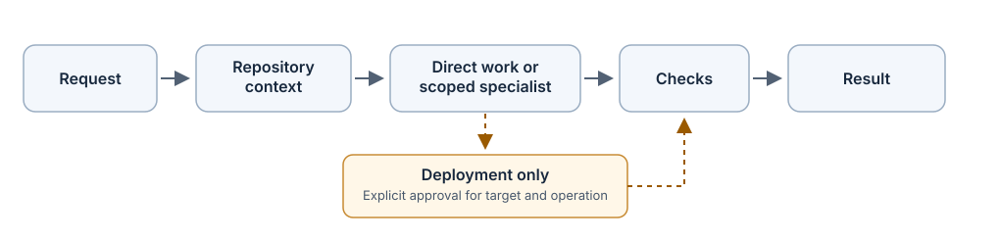

# Architrave

Architrave is a plugin and optional repository toolkit for AI coding agents. It
helps an agent follow a project's own instructions and sources, and use the
build and test commands configured for that repository. It is useful when you
want consistent, reviewable work across a codebase; for a small one-off change,
you can use your agent as usual.



The diagram is illustrative. Approval applies only when a deployment action is
explicitly authorized for a particular target and operation.

## Install the plugin

Install Architrave in an agent client you already use.

With **GitHub Copilot** (CLI, desktop app, or VS Code):

```bash
copilot plugin marketplace add dragoshont/architrave
copilot plugin install architrave@architrave
```

With **Claude Code**:

```bash
claude plugin marketplace add dragoshont/architrave
claude plugin install architrave@architrave
```

With **Codex CLI** or **Codex in the ChatGPT desktop app**, from a local clone
of this repository:

```bash
codex plugin marketplace add /path/to/architrave
codex plugin add architrave@architrave
```

Start a conversation in the host, select or invoke Architrave, and describe
the change you want. Plugin-only use does not require modifying the target
repository. The plugin adds Architrave's host-specific instructions and
roles; it uses tools already available to the host.

## Optional repository setup

Install the kit into a repository when you want repo-local roles, configured
checks, or durable task records. Run the installer from an Architrave checkout
or installed kit, with the target repository as the final argument:

```bash
python3 /path/to/architrave/tools/install_update.py install /path/to/your/repo
```

For documentation, automation, or other repositories without a product UI,
use the knowledge profile:

```bash
python3 /path/to/architrave/tools/install_update.py install --profile knowledge /path/to/your/repo
```

Review the generated `architrave.config.json` and set real repository sources
and build/test commands before relying on its checks. To generate the optional
Codex project roles during setup, add `--codex` to either install command.

## Updates

Update the plugin through its host. For the Copilot and Claude command-line
clients:

```bash
copilot plugin update architrave
claude plugin marketplace update architrave
claude plugin update architrave@architrave
```

Plugin updates do not refresh kit files copied into adopted repositories. Run
the updater from the updated kit to refresh those files:

```bash
python3 /path/to/architrave/tools/install_update.py update /path/to/your/repo
```

The updater leaves the repository's config and local agents alone by default.
Use `--agents` only when you also want to refresh copied Architrave roles; use
`--codex` to refresh generated Codex project roles.

## Limits

Architrave provides instructions and workflow support; it does not install
missing host tools, build tools, dependencies, or MCP servers. It cannot
override the host's permissions or guarantee that every host invokes every
configured check.

Repository worktrees and scope checks help separate changes, but they are not
an operating-system security sandbox. Host permissions and any actual
sandboxing are the security boundary. Infrastructure work is read-only or
plan-only by default; applying a change requires explicit authorization for
the target and operation.

## Further reading

- [Repository adoption and migration](kit/MIGRATION.md)
- [Configuration examples](kit/examples/)
- [Execution policy and host limits](knowledge/execution-policy.md)
- [Runtime and durable task records](docs/runtime-v2.md)
- [YAGNI guidance](knowledge/yagni.md)
- [Changelog](CHANGELOG.md) · [GitHub releases](https://github.com/dragoshont/architrave/releases)
